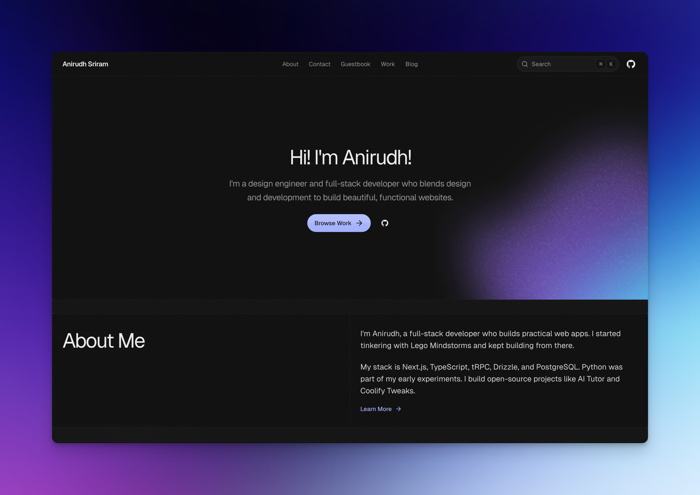

<div align="center">
  
  

  <h1>Anirudh's Portfolio</h1>

  <p>
    A clean, content-driven developer portfolio built with Next.js, Fumadocs, MDX, and shadcn/ui.
  </p>

  <p>
    <a href="https://techwithanirudh.com">Live Site</a>
    ·
    <a href="https://techwithanirudh.com/work">Work</a>
    ·
    <a href="https://techwithanirudh.com/blog">Blog</a>
    ·
    <a href="https://techwithanirudh.com/contact">Contact</a>
  </p>

  <p>
    <a href="https://github.com/techwithanirudh/portfolio/blob/main/LICENSE">
      
    </a>
    <a href="https://github.com/techwithanirudh/portfolio/stargazers">
      
    </a>
    <a href="https://github.com/techwithanirudh/portfolio/network/members">
      
    </a>
    
    
  </p>
</div>

## About

This is my personal portfolio for showcasing projects, writing, tools, and experiments. It is designed as a polished, minimal site with a typed MDX content layer, dynamic metadata, search, RSS, OG images, and a lightweight contact flow.

The project is built to be easy to maintain: content lives in `content/`, UI lives in `src/components`, and routes use the Next.js App Router in `src/app`.

## Features

- **Portfolio pages** - Dedicated work pages with project metadata, screenshots, links, and MDX content.
- **Blog system** - MDX-powered posts with tags, RSS, syntax highlighting, and generated social images.
- **Search** - Fast content search across blog and work pages.
- **AI-readable routes** - `/llms.txt`, markdown endpoints, and raw MDX routes for model-friendly reading.
- **Contact flow** - Server-action based form with spam protection and email integration.
- **Guestbook and auth** - Better Auth, database-backed sessions, comments, reactions, and moderation helpers.
- **SEO-ready** - Sitemap, robots, JSON-LD schema, metadata helpers, canonical URLs, and dynamic OG images.
- **Theme support** - Light and dark mode using `next-themes`, Tailwind CSS, and shadcn/ui primitives.

## Stack

- **Framework**: Next.js 16, React 19, TypeScript
- **Styling**: Tailwind CSS v4, shadcn/ui, Radix UI, Motion
- **Content**: Fumadocs MDX, Shiki, KaTeX, Mermaid
- **Data**: Drizzle ORM, Neon Postgres, Better Auth
- **Email**: React Email, Resend
- **Tooling**: Bun, Ultracite, CSpell, Lefthook

## Preview




## Project Structure

```txt
.
├── content/              # Blog posts and work pages written in MDX
├── emails/               # React Email templates
├── public/               # Static images, assets, resume, sitemap, robots
├── scripts/              # Local maintenance and general scripts
├── src/app/              # Next.js App Router routes and API endpoints
├── src/components/       # Shared UI, layout, MDX, and section components
├── src/constants/        # Site metadata, navigation, and portfolio data
├── src/lib/              # Source loading, metadata, auth, URL, and utilities
├── src/server/           # Database and server-only modules
└── src/styles/           # Global Tailwind CSS tokens and styles
```

## Content Workflow

- Write blog posts in `content/blog`.
- Write project pages in `content/work`.
- Use MDX frontmatter for titles, descriptions, dates, links, images, and tags.
- Run `bun run typegen` after changing content schemas or generated route types.

## License

Licensed under the [MIT license](./LICENSE).
